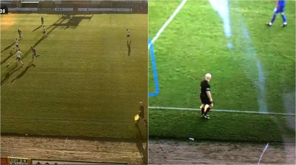

# Question #1

## Deep learning analytical thinking

### Problem description:

In 2020 when AI was doing its first steps on professional sports, the following incident became world-wide viral after one AI-based tracking system intended to follow a soccer ball got confused and started following a bald linesman instead.

### Interesting links:

- https://www.theverge.com/tldr/2020/11/3/21547392/ai-camera-operator-football-bald-head-soccer-mistakes
- https://indianexpress.com/article/trending/trending-globally/ai-camera-mistakes-referees-bald-head-for-ball-follows-it-through-the-scotland-match-6911260/
- https://www.youtube.com/watch?v=SPbTKfu0zUY

## Test:

### Assumptions:

- System was being built with a Deep Learning based model (not traditional computer vision methods) 

### Questions:

Please provide a document (and extra data if any) answering each question below; please note that no practical exercises are required here (just theoretical analysis) but feel free to add any.

1. What do you think it occurred during this model development (trainning & evaluation)? 
2. How would you fix this behavior? Please provide at least 2 options explaining their pros and drawbacks
3. Extra: Do you know any tracking algos (Deep learning based) that could be used here?
